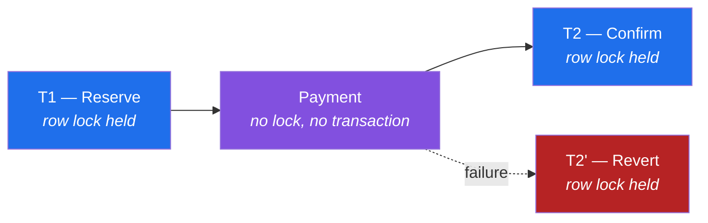
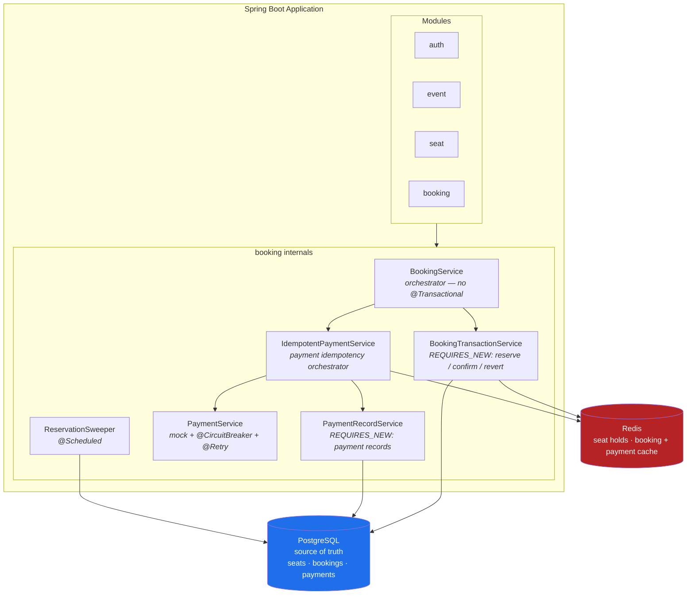
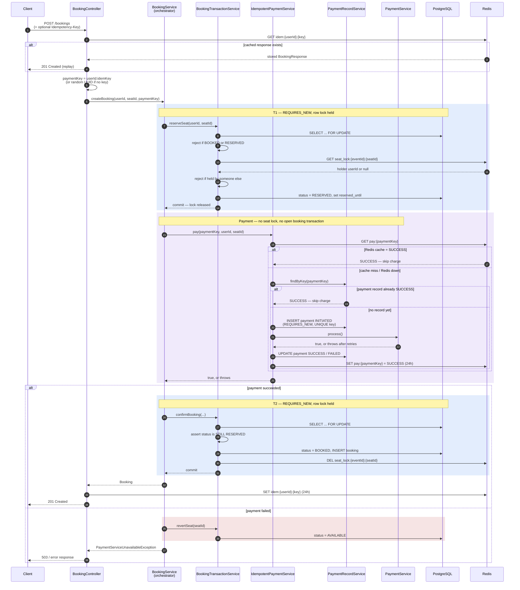
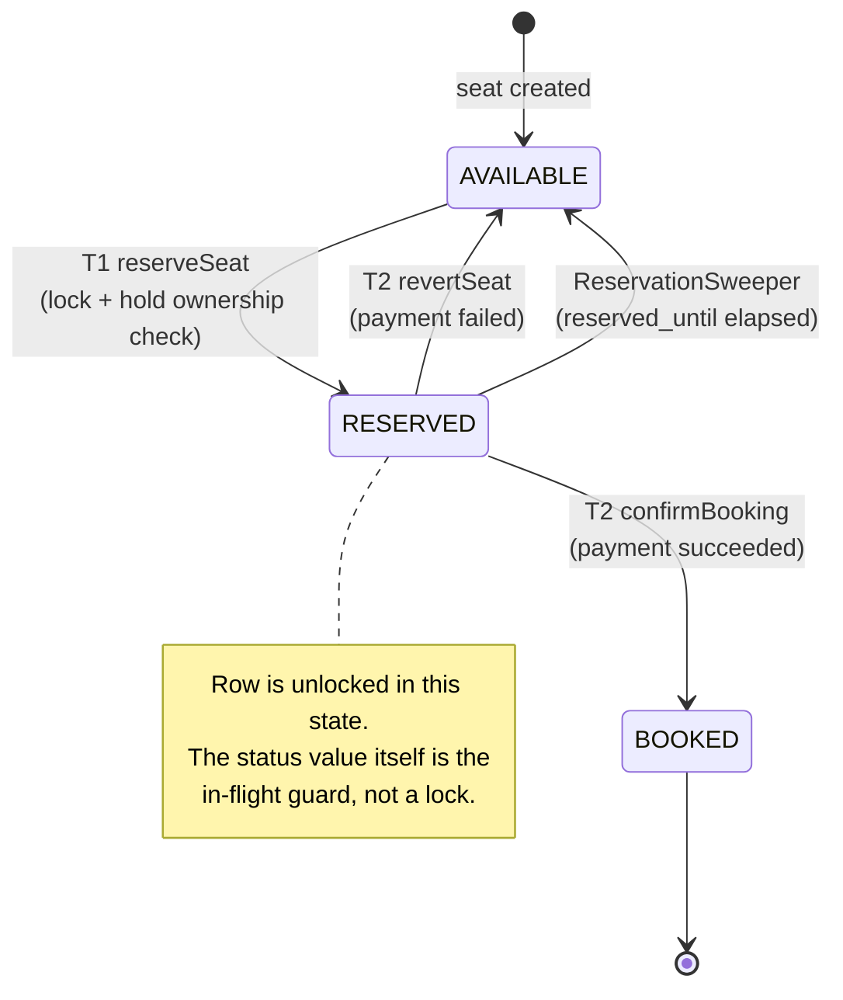
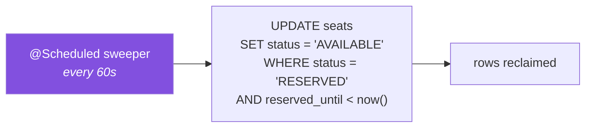
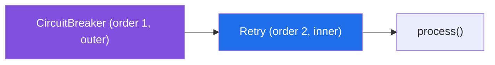
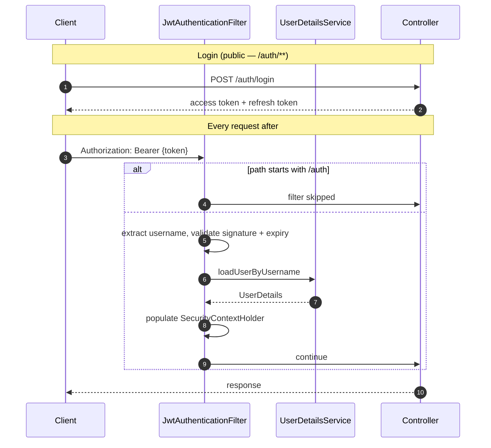
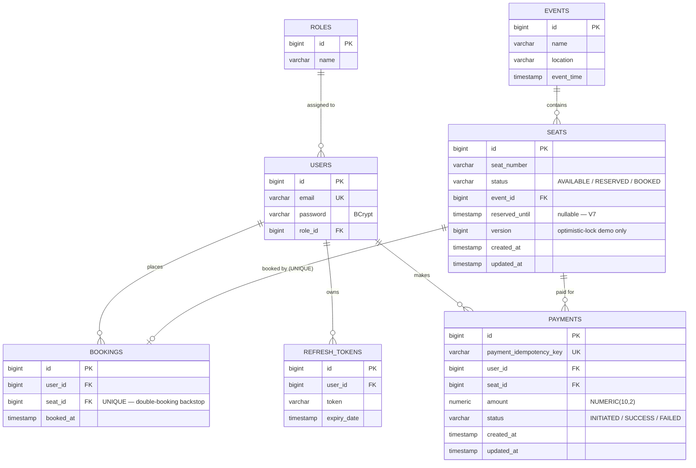

# Ticket Booking System

A production-style backend built around one question: **when hundreds of people hit "Book" on the same seat at the same millisecond, how do you guarantee exactly one of them gets it — without serializing everyone behind a payment call?**

Spring Boot 3, PostgreSQL, and Redis. Reserve-then-pay booking flow, row-level pessimistic locking, a scheduled reclaimer for abandoned reservations, JWT authentication, circuit breaker and retry on payment, per-user booking idempotency plus durable payment-level idempotency backed by a PostgreSQL `payments` table, and Flyway-managed migrations.

**Production deployment:** Dockerized Spring Boot application on Render, PostgreSQL on Neon, and Redis on Upstash.

---

## Live Demo

**Base URL:** [Live API](https://ticket-booking-system-stkb.onrender.com)

**Swagger UI:** [Open Swagger UI](https://ticket-booking-system-stkb.onrender.com/swagger-ui/index.html)

> The production API is authenticated. Log in through `/auth/login` first and use the returned access token for secured endpoints.

| Role  | Email           | Password |
|-------|-----------------|----------|
| Admin | admin@test.com  | 123456   |
| User  | user@test.com   | 123456   |

> Most endpoints require a JWT. Log in first, copy the access token, then use Swagger's **Authorize** button before calling secured endpoints.


---

## Table of Contents

- [The Core Problem](#the-core-problem)
- [Architecture](#architecture)
- [Booking Flow](#booking-flow)
- [Seat Lifecycle](#seat-lifecycle)
- [Locking Strategy](#locking-strategy)
- [The Redis Hold Layer](#the-redis-hold-layer)
- [Reservation Sweeper](#reservation-sweeper)
- [Concurrency Test Results](#concurrency-test-results)
- [Resilience](#resilience)
- [Idempotency](#idempotency)
- [Authentication](#authentication)
- [Database Schema](#database-schema)
- [API Endpoints](#api-endpoints)
- [Failure Handling](#failure-handling)
- [Testing](#testing)
- [Known Limitations](#known-limitations)
- [Tech Stack](#tech-stack)
- [Running Locally](#running-locally)
- [Lessons Learned](#lessons-learned)

---

## The Core Problem

Two users read the same seat as `AVAILABLE`, both proceed to payment, both get a booking. That's the failure this project exists to prevent.

The obvious fix — wrap the whole thing in one transaction and hold a row lock from availability check through payment to commit — works, and it's what this project did first. It has a cost that undermines its own justification: every other user contending for that seat blocks for the full duration of the payment call, including retry backoff. Pessimistic locking is chosen *to avoid* contention collapse, and then a network call is placed inside the critical section.

The current design splits the flow into three phases so the lock is only ever held for two short database transactions:



The trade this makes is explicit and worth stating up front: it removes a long lock hold and introduces a new failure mode — a seat can be left stranded in `RESERVED` if the process dies between T1 and T2. That's what the [reservation sweeper](#reservation-sweeper) exists to clean up. A design that fixes one problem by creating another is only defensible if the second one is actually handled.

---

## Architecture



`BookingTransactionService` is a **separate bean**, not a private method. Spring's `@Transactional` works through a proxy, so a `REQUIRES_NEW` method invoked from within the same class would silently join the caller's transaction and the entire reserve/pay/confirm split would collapse back into one long transaction — the exact thing it was built to avoid. Separating the bean is what makes the boundaries real. The same reasoning drives the payment components: `IdempotentPaymentService` orchestrates, `PaymentRecordService` holds the `REQUIRES_NEW` payment-record writes as a separate bean, and `PaymentService` (the mock gateway) stays separate so its Resilience4j aspects keep firing through the proxy rather than being bypassed by a self-invocation.

**Why a modular monolith rather than microservices.** Seat state and booking rows have to move together atomically. Splitting them across services would replace a local transaction with a saga — compensating actions, eventual consistency, message ordering — for no gain at this scale. The module boundaries are clean enough that extraction stays possible later.

---

## Booking Flow



Two details in that diagram carry most of the correctness:

**T2 re-checks the status after re-acquiring the lock.** Between T1 committing and T2 starting, the seat is `RESERVED` but *unlocked*. The sweeper could have reclaimed it. If T2 finds anything other than `RESERVED`, it aborts with `SeatReservationLostException` rather than writing a booking row against a seat it no longer owns.

**The revert runs in a `finally`.** Payment's failure mode is a thrown `PaymentServiceUnavailableException`, not a `false` return. Without the `finally`, every payment failure would strand a reservation and hand the cleanup to the sweeper minutes later instead of immediately.

**Payment runs through a durable idempotency layer.** `BookingService` no longer calls `PaymentService.process()` directly — it calls `IdempotentPaymentService.pay(paymentKey, ...)`, which consults Redis and a PostgreSQL `payments` record before ever charging, so a repeated request maps to the same payment rather than a second charge. The charge itself still runs outside any booking transaction; only the payment *record* is written, in its own short `REQUIRES_NEW` transactions. Details in [Idempotency](#idempotency).

---

## Seat Lifecycle



`BOOKED` is terminal — there is no cancellation flow in this project.

---

## Locking Strategy

### Pessimistic, and why

```java
@Lock(LockModeType.PESSIMISTIC_WRITE)
@Query("SELECT s FROM Seat s WHERE s.id = :id")
Optional<Seat> findByIdWithLock(@Param("id") Long id);
```

The honest justification is **throughput under contention, not correctness**. This project contains a test that makes that precise:

```
OptimisticSeatUpdateTest
  → optimisticLockingIsCorrectButFailsUnderContention()
  → 8 threads, unlocked read, 500ms overlap window, saveAndFlush
  → asserts successCount == 1
  → asserts conflictCount > 0
```

Optimistic locking produces the **right answer**: exactly one thread commits, the rest hit `ObjectOptimisticLockingFailureException`. It is not incorrect. What it does is push N−1 failures back to the caller to retry, and on a single hot seat with hundreds of contenders that degrades into repeated wasted work. Pessimistic locking makes them queue instead of collide.

The `@Version` field on `Seat` is retained solely to make that comparison runnable. It rides along in the booking path's UPDATE statement, but the row lock already serializes writers, so its check can never actually fire there. It is documented in the entity as a demonstration rather than a correctness guard.

### The storage-layer backstop

```sql
seat_id BIGINT NOT NULL UNIQUE   -- bookings table, since V1
```

Independent of every application-level mechanism. Whatever happens with locks, statuses, holds, or sweepers, the database will not accept two booking rows for one seat. Two confirmations that somehow both reached T2 collide here with a `DataIntegrityViolationException`.

---

## The Redis Hold Layer

A user can hold a seat for five minutes before confirming:

```
POST /events/hold
  → SET seat_lock:{eventId}:{seatId}  {userId}  NX PX 300000
```

`NX` makes acquisition atomic; a second holder gets `409 Conflict` without touching the database. The hold is read back during T1 — a booking is rejected if the seat is held by *another* user.

**The hold is advisory, not mandatory.** The check is:

```java
String holder = seatHoldService.getSeatHolder(eventId, seatId);
if (holder != null && !holder.equals(userId.toString())) {
    throw new SeatNotHeldByUserException("Seat is held by another user");
}
```

A seat with no hold books fine. The hold's purpose is to stop wasted work — it lets a user fill in details knowing the seat is unlikely to vanish — not to gate the booking. Correctness comes from the lock, the `RESERVED` status, and the unique constraint. Treating a five-minute Redis key with no fencing token as a correctness mechanism would be a mistake.

The production Redis connection uses Upstash over TLS. The same Redis hold implementation is used locally and in production; only the connection settings change through environment variables.

**Redis failures fail open.** `tryHoldSeat` returns `true` on a Redis exception (the caller proceeds without a real hold); `getSeatHolder` returns `null` (the ownership check is skipped); `releaseSeat` and the idempotency reads and writes swallow their errors. Redis being down degrades the experience — concurrent holders no longer get an early 409, idempotency stops replaying — but it does not stop bookings, and it cannot cause a double booking.

---

## Reservation Sweeper

A crash, a killed pod, or a lost connection between T1 and T2 leaves a seat `RESERVED` with no one coming back for it. `@Transactional` cannot help here — T1's commit is durable by design.



A seat holds `RESERVED` for **two minutes** (`RESERVATION_WINDOW`) before becoming eligible for reclaim, and the sweeper runs every **60 seconds** by default (`reservation.sweeper.fixed-delay-ms`). A stranded reservation therefore returns to `AVAILABLE` within roughly two to three minutes. The window has to comfortably exceed the worst-case payment path — three retry attempts a second apart — or the sweeper would reclaim seats out from under callers still waiting on payment.

The reclaim is a **single conditional UPDATE**. That matters for the race against T2: the `WHERE` clause takes the row lock and re-evaluates the status in the same atomic statement, so the sweeper cannot reclaim a seat that T2 has already moved to `BOOKED`. The other direction is covered by T2's post-lock status assertion. Between the two, every ordering of the race resolves safely:

| Ordering | Outcome |
|---|---|
| Sweeper commits first | T2 re-locks, finds `AVAILABLE`, aborts with `SeatReservationLostException`. No booking row. |
| T2 commits first | Sweeper's `WHERE status = 'RESERVED'` matches nothing. No-op. Booking stands. |

`SweeperReservationRaceTest` drives both orderings deterministically. A genuinely concurrent version of this test would need latches instrumented into the service and would still pass or fail on timing; asserting both observable outcomes directly proves more.

---

## Concurrency Test Results

```
Scenario: 8 threads, 1 seat, released simultaneously
Tools:    ExecutorService + CountDownLatch(1)

  ✓ bookingRepository.countBySeatId(seatId) == 1
  ✓ 7 requests rejected
  ✓ Stable across @RepeatedTest(3)
```


The restructure changed *how* the losing threads fail, which is a more interesting result than the count. With one user holding the seat and eight threads (the holder plus seven others) booking at once, measured across three repetitions with payment stubbed:

| Rejection reason | Single-transaction flow | Reserve-then-pay flow |
|---|---|---|
| `SeatAlreadyBookedException` | 81% (17/21) | ~0% |
| `SeatAlreadyReservedException` | — | 81% (17/21) |
| `SeatNotHeldByUserException` | 19% (4/21) | 19% (4/21) |

In the old flow the winner held the lock all the way through `BOOKED` and commit, so contenders queued behind that commit and saw a booked seat — and in the highest-contention repetition the hold-ownership check was not reached at all. Now T1 flips only to `RESERVED` and releases immediately, so `BOOKED` is never what a contender sees; they hit the `RESERVED` guard instead. The hold check remains the minority path, but it is now reached consistently rather than intermittently skipped, because the window in which a contender can acquire the lock before the holder is no longer collapsed by a long-held commit.

---

## Resilience

### Circuit breaker and retry

```properties
resilience4j.retry.instances.paymentService.max-attempts=3
resilience4j.retry.instances.paymentService.wait-duration=1s
resilience4j.retry.instances.paymentService.retry-exceptions=com.ticketing.shared.exception.PaymentFailedException

resilience4j.circuitbreaker.instances.paymentService.sliding-window-size=5
resilience4j.circuitbreaker.instances.paymentService.failure-rate-threshold=50
resilience4j.circuitbreaker.instances.paymentService.wait-duration-in-open-state=30s
resilience4j.circuitbreaker.instances.paymentService.permitted-number-of-calls-in-half-open-state=2

resilience4j.circuitbreaker.circuit-breaker-aspect-order=1
resilience4j.retry.retry-aspect-order=2
```

**Those two order values are load-bearing and easy to get backwards.** Spring AOP orders ascending — **lower value means the outer aspect**. So `circuit-breaker=1` / `retry=2` puts the circuit breaker *outside* retry:



That is the arrangement you want: all three attempts run inside the breaker, and only the final outcome reaches the fallback. Reversing them makes the breaker inner, so its fallback fires on the *first* failure and throws `PaymentServiceUnavailableException` — which isn't in `retry-exceptions`, so retry never engages and `max-attempts=3` becomes dead configuration.

This was verified rather than assumed. `PaymentServiceRetryTest` forces `process()` to always throw and counts body executions:

| Aspect order | `process()` executions |
|---|---|
| `circuit-breaker=1`, `retry=2` (current) | **3** |
| `circuit-breaker=2`, `retry=1` | **1** |

The test stays in the suite as a regression guard so nobody swaps the numbers on the strength of an intuition.

### Fallback behaviour

`paymentFallback(Exception)` never returns — it always throws `PaymentServiceUnavailableException`, distinguishing an open breaker (`CallNotPermittedException`) from exhausted retries for logging purposes. Because that exception is unchecked and payment now runs outside any transaction, the failure path is handled by the orchestrator's `finally` block, which reverts the reservation.

> **Payment is simulated** — `Math.random() < 0.3` throws. There is no external gateway. The retry, breaker, and fallback machinery is real; the thing it protects is not.

---

## Idempotency

Two distinct idempotency mechanisms exist here, and they are not the same thing. **Booking idempotency** makes the HTTP request replayable; **payment idempotency** makes the charge itself happen at most once. The project *derives* the payment key from the booking key because payment is part of the same booking operation — not because the two are the same concept.

### A. Booking idempotency

An optional `Idempotency-Key` header makes retried booking requests safe:

```
Idempotency-Key: 550e8400-e29b-41d4-a716-446655440000
```

The response is cached in Redis for 24 hours under `idem:{userId}:{key}`, and a replay returns the same body with the same **201 Created** status as the original.

**The key is scoped per user.** A globally-scoped key would collide when two clients happened to generate the same UUID — or when one deliberately reused another's — and the second caller would receive the first caller's `bookingId` and `userId`. Scoping by user makes that structurally impossible.

**What this protects and what it doesn't.** The cache entry is written *after* processing completes. That covers the sequential case — a client retries after a timeout or a user double-submits a few seconds apart. It does **not** cover two identical requests arriving simultaneously: both find an empty cache and both proceed. Preventing that would require writing an in-flight marker before processing. For the same-seat case it doesn't matter, because the reservation and the unique constraint stop the duplicate anyway.

### B. Payment idempotency

The payment key is derived in the controller from the booking key:

```java
String paymentKey = (idempotencyKey != null)
        ? userId + ":" + idempotencyKey
        : UUID.randomUUID().toString();
```

When the client sends an `Idempotency-Key`, the payment key is stable across retries of the same booking request, so a retried request maps to the same payment record. When no key is sent, a fresh random UUID is generated **per attempt** — each attempt is then its own payment, so cross-request payment deduplication requires the client to supply a key.

`IdempotentPaymentService.pay(paymentKey, userId, seatId)` resolves in order:

1. **Redis fast path** — `GET pay:{paymentKey}`; if it reads `SUCCESS`, return immediately without charging. Fail-open: a Redis error is treated as a miss.
2. **PostgreSQL durable record** — on a cache miss, look up the `payments` row by its `UNIQUE` `payment_idempotency_key`. If it is already `SUCCESS`, return without charging (and repopulate the cache).
3. **Charge once** — if no record exists, INSERT an `INITIATED` row in its own `REQUIRES_NEW` transaction, call the existing `PaymentService.process()`, then UPDATE the row to `SUCCESS` or `FAILED` and cache `SUCCESS` in Redis.

The record is written **before** the charge so the payment's identity is durable even if the process dies mid-charge. Two properties follow from the `INITIATED → SUCCESS/FAILED` lifecycle plus the `UNIQUE` key:

- **Redis is only a cache.** If Redis is unavailable *or* the cache entry is simply missing, the PostgreSQL record still stops an already-`SUCCESS` payment from being charged again. PostgreSQL is the source of truth; Redis just makes the common case fast.
- **Concurrent duplicates collapse to one charge.** Two requests with the same key race on the INSERT; the `UNIQUE` constraint lets exactly one create the `INITIATED` row and call `process()`. The loser catches the constraint violation and defers to the existing record instead of charging again.

A `FAILED` record can be retried on the same row — no second row is ever created for one key — and only a `SUCCESS` short-circuits the charge.

> The charge itself is still simulated. `PaymentService.process()` is unchanged (`Math.random() < 0.3` throws), wrapped by the existing Resilience4j retry and circuit breaker. Payment idempotency is about not repeating that simulated call, not about integrating a real gateway.

---

## Authentication



Configuration: CSRF disabled (stateless API, token in a header, no ambient credential to exploit), sessions `STATELESS`, HTTP Basic and form login disabled, `@EnableMethodSecurity` on, JWT filter registered before `UsernamePasswordAuthenticationFilter`.

Public paths: `/auth/**`, `/swagger-ui/**`, `/v3/api-docs/**`, `/swagger-ui.html`. Everything else authenticated.

---

## Database Schema



Schema is version-controlled through Flyway, `V1` to `V8`. `V7` adds the nullable `reserved_until` column the sweeper keys off; `V8` adds the `payments` table, whose `payment_idempotency_key` carries the `UNIQUE` constraint (`uq_payment_idem_key`) that anchors payment idempotency, with foreign keys to `users` and `seats`. `status` on both `seats` and `payments` is stored as a string with no DB-level `CHECK` constraint, which is why adding `RESERVED` to the seat enum needed no migration of its own.

---

## API Endpoints


### Authentication

| Method | Endpoint        | Auth   | Description              |
|--------|-----------------|--------|--------------------------|
| POST   | /auth/register  | Public | Register new user        |
| POST   | /auth/login     | Public | Login, returns JWT pair  |
| POST   | /auth/refresh   | Public | Refresh access token     |
| POST   | /auth/logout    | Bearer | Invalidate refresh token |

### Events

| Method | Endpoint     | Auth   | Description     |
|--------|--------------|--------|-----------------|
| POST   | /events      | Admin  | Create event    |
| GET    | /events      | Bearer | List all events |
| GET    | /events/{id} | Bearer | Get event by ID |

### Seats

| Method | Endpoint                  | Auth   | Description             |
|--------|---------------------------|--------|-------------------------|
| POST   | /events/{eventId}/seats  | Admin  | Add seat to event       |
| GET    | /events/{eventId}/seats  | Bearer | List seats for event    |
| POST   | /events/hold             | Bearer | Hold seat for 5 minutes |

### Bookings

| Method | Endpoint       | Auth   | Description                              |
|--------|----------------|--------|------------------------------------------|
| POST   | /bookings      | Bearer | Create booking (optional Idempotency-Key)|
| GET    | /bookings/{id} | Bearer | Get booking by ID                        |

---

## Failure Handling

| Scenario                                  | Behaviour                                                            |
|-------------------------------------------|----------------------------------------------------------------------|
| Two users book the same seat              | Row lock serializes them; one reserves, the other is rejected         |
| Seat already booked                       | `SeatAlreadyBookedException` → 409                                    |
| Seat mid-flight for another user          | `SeatAlreadyReservedException` → 409                                  |
| Seat held by a different user             | `SeatNotHeldByUserException` → 409                                    |
| Payment fails after retries               | Reservation reverted in `finally`; seat returns to `AVAILABLE`        |
| Payment service degraded                  | Circuit breaker opens, fallback throws immediately without waiting    |
| Process dies between reserve and confirm  | Sweeper reclaims the seat once `reserved_until` elapses (~2–3 min)    |
| Sweeper reclaims during confirm           | T2's post-lock status check aborts with `SeatReservationLostException`|
| Redis unavailable                         | Holds and idempotency degrade silently; bookings continue             |
| Seat hold expires                         | Redis TTL removes the key after 5 minutes                             |
| Duplicate sequential booking request      | Idempotency key replays the cached 201 response                       |
| Duplicate / retried payment (same key)    | Redis cache or the `payments` record returns the prior `SUCCESS`; `process()` is not called again |
| Redis cache missing for a prior payment   | PostgreSQL `payments` record (UNIQUE key) still blocks a second charge |
| Concurrent identical payment requests     | UNIQUE `payment_idempotency_key`: one INSERT wins and charges, the other defers — one charge |
| Payment succeeds but seat reclaimed before confirm | T2 aborts with `SeatReservationLostException`; payment stays `SUCCESS` with no booking (known limitation) |
| Two booking rows for one seat             | `seat_id UNIQUE` rejects the second insert at the database            |

---

## Testing

```bash
docker compose up -d
.\mvnw.cmd clean test
```

```
109 tests — 0 failures — 0 errors — 0 skipped

Controller tests        — auth, booking, seat, event
Service tests           — orchestration, transaction units, payment, hold logic
Payment idempotency     — durable record, Redis/Postgres fallback, concurrent duplicate charge
Concurrency tests       — 8-thread races, hold-aware races
Sweeper race tests      — both orderings of sweeper vs. confirm
Resilience tests        — retry attempt counting, fallback behaviour
Exception handler tests — every custom exception mapping
```

**The suite runs against an empty database.** Integration tests extend a shared base that seeds its own event, seats, and users in `@BeforeEach` rather than depending on pre-existing rows. Verified by running the full suite against a freshly created database with only Flyway migrations applied — 109 passing, 0 skipped. Postgres and Redis must be running (`docker compose up -d`); the concurrency tests exercise real row locking rather than mocking it out, and payment idempotency is covered by `IdempotentPaymentServiceTest` (unit) and `PaymentIdempotencyIntegrationTest` (concurrent duplicate charge, plus a Redis-evicted PostgreSQL fallback, both against the real containers). Configuration is loaded from the git-ignored `.env` automatically (see [Running Locally](#running-locally)), so no manual environment export is required to run the suite.

An earlier version of the suite hardcoded seat and user IDs that existed only in a local Docker volume. It passed on the machine it was written on and would have failed on every clone. Self-seeding fixtures are the fix; the lesson is that a green suite proves nothing about a suite you have never run somewhere else.

---

## Known Limitations

These are real. They are listed because a design document that admits nothing is not worth reading.

- **Payment is simulated.** `Math.random() < 0.3`. The resilience patterns wrapping it are genuine, but no measurement here reflects the behaviour of a real gateway, and no performance claim in this document is backed by a benchmark. The reserve-then-pay restructure was made for architectural correctness, not a measured throughput win.

- **Payment can succeed without a booking (consistency window).** The charge runs outside the reserve/confirm database transaction. If it takes longer than the two-minute reservation window and the sweeper reclaims the seat — possibly rebooked by someone else — before T2, the `payments` record reaches `SUCCESS` while T2 aborts with `SeatReservationLostException`: a durable payment with no booking. This is deliberately **not** solved here by authorization/capture or refunds. The production fixes would be to *authorize the payment and capture it only after the seat is confirmed*, or to run a *compensating refund / reconciliation* job — neither is implemented in this project. Payment idempotency does not close this window; it only guarantees the charge is not *repeated*.

- **Concurrency tests stub payment.** Under reserve-then-pay, the first thread reserves before paying, so contenders fail fast rather than queueing. A single random payment failure therefore yields *zero* bookings for that batch, not one — the old single-transaction flow let the next queued thread absorb the failure. Better lock duration, less cross-thread payment resilience. Tests stub payment to isolate locking behaviour; `PaymentServiceRetryTest` covers payment separately.

- **`releaseSeat` deletes the hold unconditionally.** It takes only `(eventId, seatId)` and issues a bare `DEL` with no ownership check. Correct release needs a compare-and-delete — a Lua script or a fencing token — which is also what a hold would need before it could be trusted for anything beyond UX.

- **No heartbeat on holds.** The five-minute TTL is set once and never extended. A user who takes longer than that loses the hold silently, and the booking then succeeds anyway because the hold is advisory.

- **The reservation window is a hardcoded two minutes.** It has to exceed the slowest payment path, which today is a known constant. A real gateway with variable latency would want the window derived from a request timeout rather than fixed.

- **Idempotency does not cover simultaneous duplicates.** Discussed [above](#idempotency). Needs an in-flight marker written before processing.

- **`BookingController` extracts `userId` by parsing the bearer token directly** rather than reading `SecurityContextHolder`, which the JWT filter has already populated. Two parallel authentication paths where one would do. Harmless today, a divergence risk tomorrow.

- **The sweeper is a single-instance assumption.** `@Scheduled` fires on every running instance. Multiple replicas would run the reclaim concurrently — the conditional UPDATE keeps that safe, but it is wasted work, and any future sweeper logic that isn't a single atomic statement would need distributed scheduling.

- **No booking cancellation.** `BOOKED` is terminal. Seat release after booking is out of scope.

---

## Tech Stack

| Layer            | Technology                  |
|------------------|-----------------------------|
| Language         | Java 21                     |
| Framework        | Spring Boot 3               |
| Security         | Spring Security + JWT       |
| Database         | PostgreSQL                  |
| ORM              | Spring Data JPA / Hibernate |
| Cache            | Redis                       |
| Migrations       | Flyway (V1–V8)              |
| Resilience       | Resilience4j                |
| API docs         | Swagger / OpenAPI 3         |
| Testing          | JUnit 5, Mockito, ExecutorService |
| Build            | Maven                       |
| Containerization | Docker                      |
| Deployment       | Render                      |
| Production DB    | Neon PostgreSQL             |
| Production Redis | Upstash Redis               |

---

## Running Locally

```bash
git clone https://github.com/pranshu-2853/ticket-booking-system.git
cd ticket-booking-system
cp .env.example .env      # then fill in the local values shown below
docker compose up -d
.\mvnw.cmd spring-boot:run
```

- App: `http://localhost:8080`
- Swagger: `http://localhost:8080/swagger-ui/index.html`

Flyway builds the schema on startup and seeds demo data. The test suite seeds its own fixtures and needs no pre-existing rows.

The application imports the git-ignored `.env` automatically via `spring.config.import=optional:file:.env[.properties]` in `application.properties`, so `mvn spring-boot:run` and `mvn test` pick up the values with **no manual `export` / `$env:` step**. The `optional:` prefix means the import is simply skipped when `.env` is absent — for example on Render, where real environment variables are supplied instead.

### Environment variables

```env
DB_URL=jdbc:postgresql://localhost:5332/ticketdb
DB_USER=admin
DB_PASSWORD=admin
REDIS_HOST=localhost
REDIS_PORT=6380
REDIS_PASSWORD=
REDIS_SSL_ENABLED=false
JWT_SECRET=your-secret-key
```

`DB_USER` / `DB_PASSWORD` match the `docker-compose.yml` Postgres credentials (`admin` / `admin`). Postgres is published on host port **5332** (`docker-compose.yml` maps `5332:5432`) so it does not clash with a local Postgres install, and Redis on **6380**. `.env.example` is the committed template with empty values; copy it to `.env` and fill in the values above. `.env` itself is git-ignored and never committed or deployed.

### Swagger access

1. Log in with a demo account.
2. Copy the access token from the response.
3. Click **Authorize** and enter `Bearer <your_access_token>`.
4. Call authenticated endpoints.

---

## Production Deployment

The application is deployed as a Dockerized Spring Boot web service on Render.

### Production infrastructure

- **Application:** Spring Boot 3.x running in Docker on Render
- **Database:** PostgreSQL on Neon
- **Redis:** Upstash Redis
- **Database migrations:** Flyway
- **Authentication:** JWT
- **Configuration:** Environment variables
- **Container build:** Dockerfile

### Production architecture

```text
                         ┌──────────────────────┐
                         │   Neon PostgreSQL    │
                         │   source of truth    │
                         └──────────▲───────────┘
                                    │
Client ───── HTTPS ──────> Render ──┤
                           Spring   │
                           Boot     │
                           Docker   │
                                    │
                         ┌──────────▼───────────┐
                         │     Upstash Redis     │
                         │ seat holds + idempotency │
                         └───────────────────────┘
```

The Dockerfile is used to build and run the Spring Boot application. Docker Compose remains a local-development setup for PostgreSQL and Redis; those local containers are not deployed to Render. The local `.env` file is git-ignored and never deployed; the `spring.config.import` that reads it is marked `optional:`, so on Render it is a no-op and configuration comes entirely from Render's own environment variables.

### Production environment variables

The application reads production configuration from environment variables rather than storing credentials in `application.properties`:

```text
DB_URL
DB_USER
DB_PASSWORD

REDIS_HOST
REDIS_PORT
REDIS_PASSWORD
REDIS_SSL_ENABLED

JWT_SECRET
```

Render provides the `PORT` environment variable automatically. The application uses:

```properties
server.port=${PORT:8080}
```

so local development falls back to port `8080`, while the deployed application listens on Render's assigned port.

### Live endpoints

- **App:** https://ticket-booking-system-stkb.onrender.com
- **Swagger:** https://ticket-booking-system-stkb.onrender.com/swagger-ui/index.html

---

## Lessons Learned

**A lock held across a slow call defeats the reason you chose the lock.** The first version of this project argued for pessimistic locking to avoid contention collapse, then held the row lock through payment and its retry backoff. The argument and the implementation contradicted each other, and splitting into reserve → pay → confirm is what resolved it.

**Fixing that introduced a worse-shaped bug, and admitting so is the point.** Committing `RESERVED` in its own transaction makes the state durable — which means a crash strands it forever, where the single-transaction version would simply have rolled back. Trading a lock-duration problem for a stuck-inventory problem is only an improvement if the sweeper exists. It does.

**Measure before concluding — including when the conclusion sounds authoritative.** The Resilience4j aspect ordering was very nearly reversed on the strength of a plausible-sounding rule ("higher order is outer"). A test that counted actual method executions showed the existing configuration was already correct and the "fix" would have silently disabled retries. That test is now a permanent guard.

**Test what a claim actually demonstrates.** The optimistic-locking test was described as proving optimistic locking is *unreliable*. Its own assertion is `successCount == 1` — it proves the opposite. The real argument for pessimistic locking is throughput under contention, and the test now says so.

**A green suite on your own machine proves less than it appears to.** The concurrency tests depended on rows that existed only in a local Docker volume. Anyone cloning the repository would have seen it fail on the first run.
